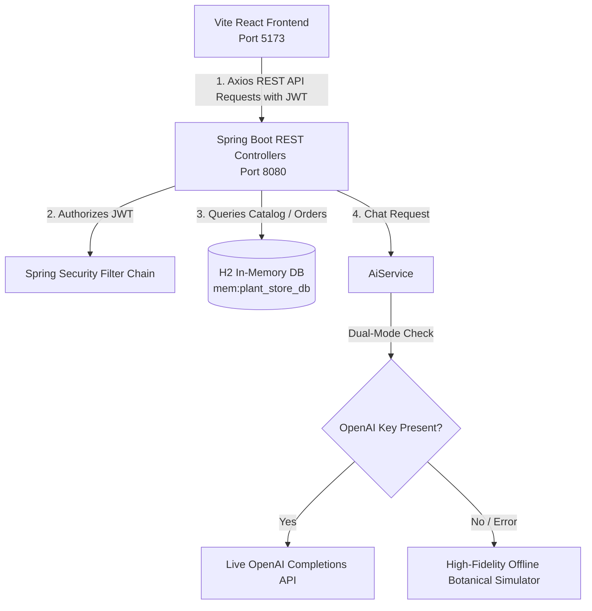

# 🍃 PlantVision AI — Full-Stack Botanical Assistant & E-Commerce

PlantVision AI is a premium, full-stack application designed to act as a complete smart garden hub. It combines highly advanced biological tools (including an AI Image Diagnostic Scanner and a premium glassmorphic Botanical Chatbot) with complete e-commerce checkout workflows, custom shopping carts, and logistics delivery timeline trackers.

---

## 🛠️ Technology Stack & Badges


---

## 🏗️ System Architecture



---

## 🌟 Core Features

### 1. 🧠 AI Plant Diagnostics (Smart Image Scanner)
* **How it works**: Head to the **AI Diagnostic Center**, upload any plant photo, and let the AI scan its cellular structure. 
* **Dual-Mode Integration**: Includes live API stubs for **Plant.id API** and **OpenAI Vision API**.
* **Smart Offline Simulator**: Falls back automatically when keys are empty. Name your file with keywords like `aloe`, `rose`, `mint`, `lavender`, `tomato`, or `snake` to get custom diagnostics matching e-commerce products!

### 2. 🤖 AI Botanical Assistant Chatbot
* **Premium Chat bubble**: A pulsing emerald trigger located in the bottom-right corner of the application viewport (visible to logged-in users).
* **Glassmorphic Conversational Interface**: sliding drawer featuring premium dark themes, organic drop shadows, and heavy backdrop blur filters.
* **Onboarding Suggestion Chips**: Tappable fast-onboard suggestion chips (*"How to water Aloe Vera?"*, *"Why are leaves turning yellow?"*) to guide users.
* **Rich HTML Formatting**: Renders markdown highlights (`**bold**`, `*italic*`), lists, line breaks, and advice blocks elegantly in chat bubbles.
* **Typing Indicator**: Features smooth bouncing three-dot micro-animations reflecting active thinking statuses.

### 3. 🛍️ Greenhouse E-Commerce Store
* Browse 15+ pre-seeded, hand-selected houseplants mapped across 4 core botanical categories (`Flower Plants`, `Fruit Plants`, `Decoration Plants`, `Medicinal Plants`).
* Dynamic hover micro-animations, price points, stock availability indicators, and interactive descriptions.
* Full cart operations context supporting addition, subtraction, deletion, and pricing recalculations.

### 🚚 4. Logistics Delivery Ledger
* Real-time shipping ledger tracking orders through 4 major stages: **Order Confirmed** ➔ **Sprout Packaging** (climate-isolated casing) ➔ **Logistics Transit** ➔ **Safely Arrived**.
* Shows custom estimated delivery schedules and climate control safety warnings.

---

## 🚀 Local Quick-Start Guide

### Prerequisites
* **Java SDK 21** or higher.
* **Node.js v18** or higher (Tailwind v3 setup ensures complete compatibility on Node 18 environments).

### 1. Run the Spring Boot Backend
1. Navigate to the backend directory:
   ```bash
   cd backend
   ```
2. Build and run the server using the Maven wrapper:
   ```bash
   .\mvnw spring-boot:run
   ```
   The backend will boot up in under 6 seconds on **`http://localhost:8080`**.
3. *Optional H2 DB Diagnostic console*: Access **`http://localhost:8080/h2-console`** (JDBC URL: `jdbc:h2:mem:plant_store_db`, User: `sa`, Password: *(none)*).

### 2. Run the React Frontend
1. Navigate to the frontend directory:
   ```bash
   cd ../frontend
   ```
2. Install the lightweight JS dependencies:
   ```bash
   npm install
   ```
3. Boot the Vite hot-reloading development server:
   ```bash
   npm run dev
   ```
   The frontend will immediately start on **`http://localhost:5173/`**.

---

## 🔒 Configuration & API Keys

To enable live AI completions and advanced vision diagnostics, add your API keys inside the backend configuration file:
📁 [backend/src/main/resources/application.properties](file:///backend/src/main/resources/application.properties)

```properties
# OpenAI API Key (Enables Live Botanical Assistant Chat completions)
app.ai.openai.key=your_openai_api_key_here

# Plant.id API Key (Enables Live Plant Identification Scanner)
app.ai.plantid.key=your_plant_id_key_here
```
*Note: If these properties are blank, PlantVision AI will seamlessly fall back to high-fidelity biological offline simulators so you can test all features without spend limits.*

---

## 📦 Packaging Standalone Production Builds

To package both modules for easy distribution or cloud deployments:

### Package Frontend Assets
Generates optimized, minified HTML/CSS/JS inside `frontend/dist/`:
```bash
cd frontend
npm run build
```

### Package Backend Standalone JAR
Compiles Java modules and outputs a standalone bootable executable inside `backend/target/`:
```bash
cd backend
.\mvnw clean package -DskipTests
```
To run the fully packaged production backend:
```bash
java -jar backend/target/backend-0.0.1-SNAPSHOT.jar
```

---

## 🏁 User Accounts
Use these pre-configured user credentials or register your own directly via the login workspace:
* **Customer Account**: `user@gmail.com` / `user123`
* **Admin Operations**: `admin@gmail.com` / `admin123`
